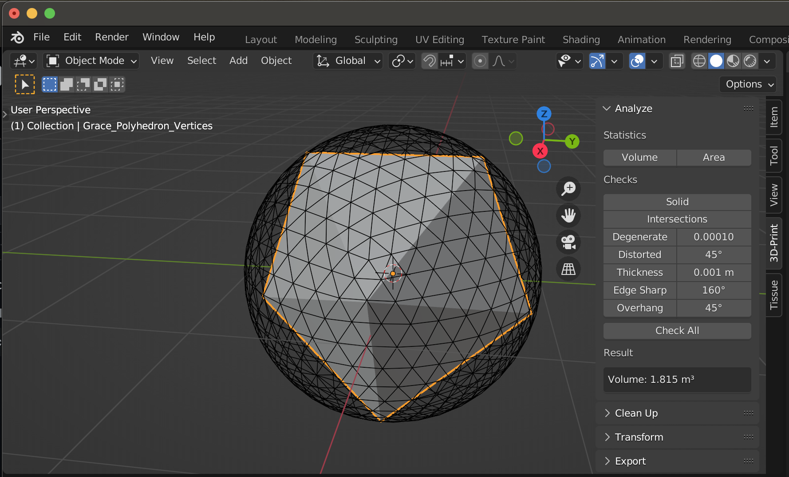

# Grace's 8-Vertex Polyhedron Blender Project

This repository contains a Blender project and script for generating Grace's 8-Vertex Polyhedron, 
which maximizes the volume for a polyhedron with eight vertices inscribed in a unit sphere.

## Files Included
- [`Graces_Polyhedron.blend`](./Graces_Polyhedron.blend): The Blender project file.
- [`graces_polyhedron_script.py`](./graces_polyhedron_script.py): The script to generate the polyhedron.

## Compatibility
This project was created using **Blender 3.3.1**. The script and project file should work with Blender 3.x versions, but you might need to make minor adjustments if using a different version. If you encounter any issues, consider checking for the following:
- **Script Compatibility**: Some Blender Python API functions might differ slightly between versions, so ensure that the functions used are supported in your version.
- **User Interface**: The location of certain tools or settings in Blender may change between versions, so refer to the Blender documentation for the version you are using.

## Screenshot
Here’s a screenshot of the polyhedron generated in Blender:

## How to Use
1. Open `Grace_Polyhedron.blend` in Blender.
2. Run the script in the Scripting tab to regenerate the polyhedron.

## How to Run the Script in Blender
To generate Grace's Polyhedron in Blender using the provided script, follow these steps:

1. **Open the Blender Project**:
   - Download and open the `Graces_Polyhedron.blend` file in Blender.

2. **Access the Scripting Workspace**:
   - At the top of the Blender window, switch to the **Scripting** workspace. This will open the Text Editor and Python Console areas.

3. **Load the Script**:
   - In the Text Editor, click on **Open** and navigate to the `grace_polyhedron_script.py` file. This will load the script into the Text Editor.

4. **Run the Script**:
   - With the script loaded, click the **Run Script** button at the top of the Text Editor. This will execute the script and generate the polyhedron in the 3D Viewport.

5. **Inspect the Generated Polyhedron**:
   - After running the script, the polyhedron should appear in the 3D Viewport. You can use Blender’s tools to inspect, rotate, or modify the polyhedron.

## References
- [Grace's Polyhedron Discovery](https://www.ams.org/journals/mcom/1963-17-082/S0025-5718-63-99183-X/S0025-5718-63-99183-X.pdf)
- [YouTube Video Explanation](https://www.youtube.com/watch?v=XZy3rXr2yeM&t=387s)
- [Convex Hull in Geometry](https://en.wikipedia.org/wiki/Convex_hull)
- [Platonic and Archimedean Solids](https://mathworld.wolfram.com/PlatonicSolid.html)
